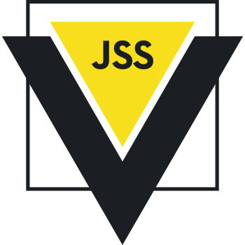

<br/>
<p align="center">
  
</p>

# Vue JSS Plugin

The Vue JSS plugin implements one of the most flexible CSS-in-JS framework inside Vue.js components. About JSS you can read more in the 📖 [JSS documentation](https://cssinjs.org).

## Installation

The plugin contains bundled-in [JSS](https://www.npmjs.com/package/jss) package, so install only **vue-jss-plugin** by **npm** or **yarn**.

```sh
$ npm install vue-jss-plugin
```

## Usage

In your main app file import **vue** and **vue-jss-plugin**, then use it as a regular plugin.

```js
import Vue from 'vue';
import jssPlugin from 'vue-jss-plugin';

Vue.use(jssPlugin);
```

Adding styles to component options allows you to automatically inject jss to project and assign classes names to component scoped variable. Read more about JSS syntax in the [JSS Syntax documentation](https://cssinjs.org/jss-syntax/).

```js
import HelloWorld from './components/HelloWorld.vue';

const styles = {
  app: {
    fontFamily: '"Avenir", Helvetica, Arial, sans-serif',
    WebkitFontSmoothing: 'antialiased',
    MozOsxFontSmoothing: 'grayscale',
    textAlign: 'center',
    marginTop: '60px',

    // Reactive style example:
    // Vue component instance is passed as first argument, so you can use there all props, data, computed values.
    color: ({themeColor}) => themeColor,
  },
};

export default {
  name: 'app',
  // Add JSS rules as styles in component configuration:
  styles,
  components: {
    HelloWorld,
  },
  data() {
    return {
      themeColor: '#2c3e50',
    };
  },
  mounted() {
    this.$classes; // All available classes names from JSS rules.
  },
};
```

In template you can use `$classes` variable to get component scoped class name.

```html
<template>
  <div id="app" :class="$classes.app">
    
    <HelloWorld msg="Welcome to Your Vue.js App"/>
  </div>
</template>
```
